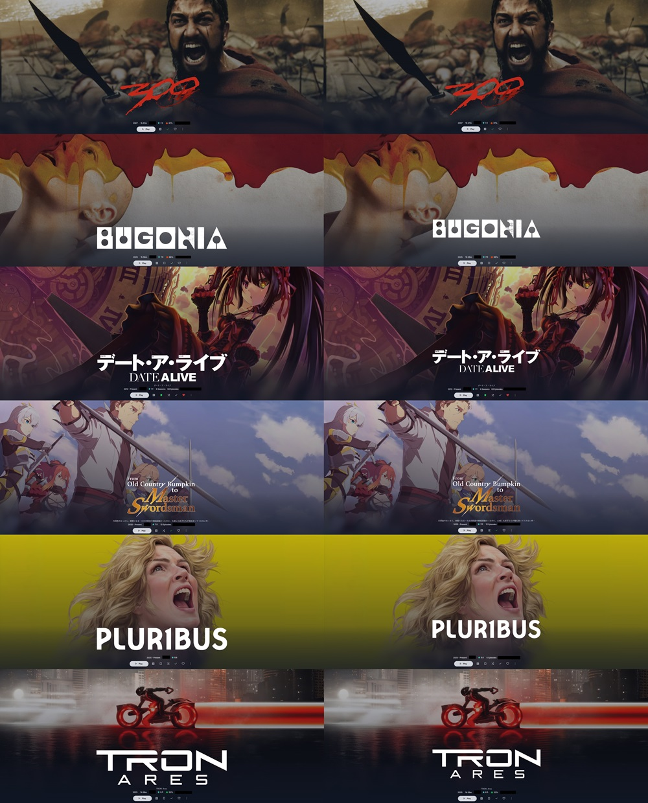
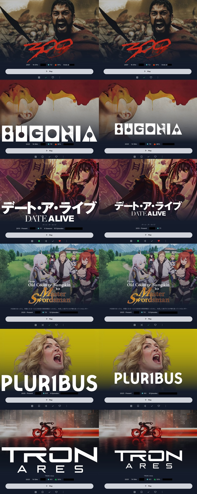
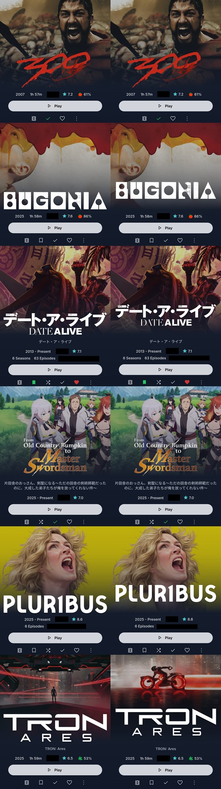

# Before & After (Real-World Results)

Logos look fine in isolation — the chaos only becomes obvious when you see them side-by-side, displayed on an actual device.  
Below are three device classes: Desktop (QHD), Tablet (WQXGA), and Mobile (20:9, 1116×2484).  

Each grid compares:

- **Left:** the untouched, original TMDb logo (in various sizes)  
- **Right:** the normalized, padded, canvas-aligned version generated by JFIN. These examples use the default canvas size (800×310) with padding enabled.

Theme used in examples: [ElegantFin by lscambo13](https://github.com/lscambo13/ElegantFin)

### 🖥️ Desktop (QHD)

### 📚 Tablet (WQXGA)

### 📱 Mobile (20:9)

Even at a glance, you can see what changes:

- Logos stop jumping up and down between rows  
- Width becomes consistent  
- Ultra-wide logos no longer stretch across half the UI  
- Tiny logos stop looking like afterthoughts  

The result is a grid that looks intentional instead of “AI-was-left-unsupervised.”